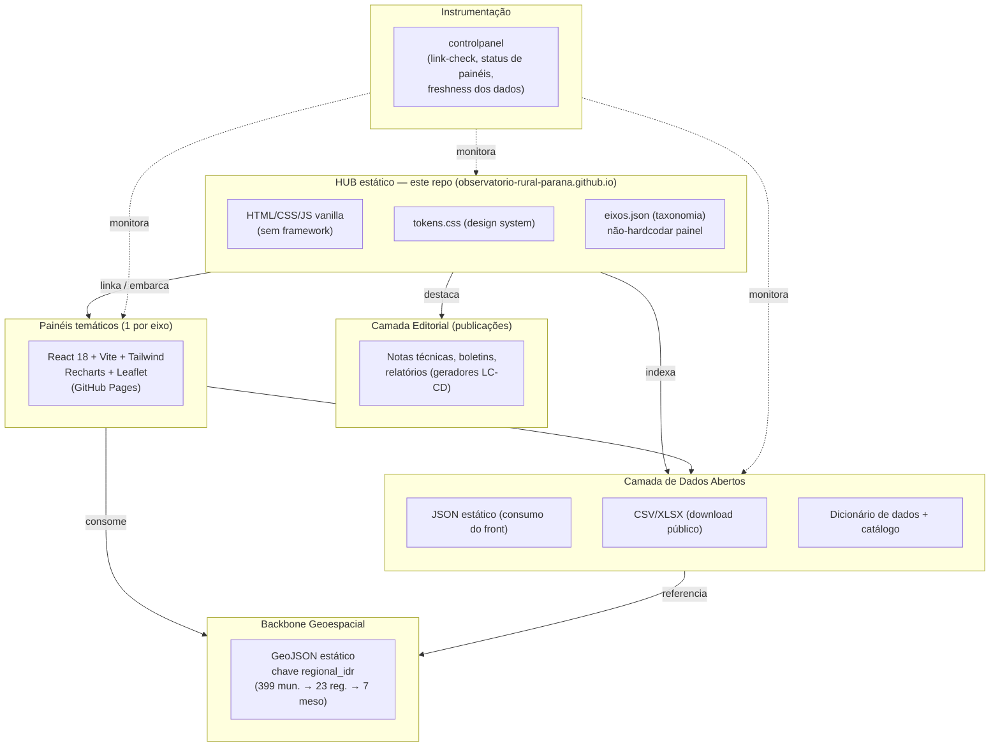
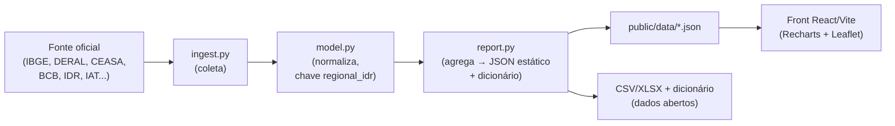
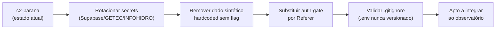

# Arquitetura — Observatório Rural Paranaense

> Documento de arquitetura do observatório. Define as camadas, a stack padrão, o
> cookiecutter de painel, a governança da organização e as políticas obrigatórias
> de Segurança e LGPD.
>
> Fontes da verdade (NÃO duplicar/divergir aqui):
> - Contexto, decisões e convenções: [`docs/PROJETO-BRIEF.md`](./PROJETO-BRIEF.md)
> - Design system (cores/tipografia/espaçamento): [`assets/css/tokens.css`](../assets/css/tokens.css) — sempre `var(--…)`, nunca hex solto.
> - Taxonomia de eixos e painéis: [`assets/data/eixos.json`](../assets/data/eixos.json) — nunca hardcodar painel em HTML; ler sempre do JSON.
> - Backbone geoespacial: [`docs/GEO.md`](./GEO.md) (chave única `regional_idr`).

---

## 1. Visão em camadas

O observatório não é um app monolítico: é um **hub editorial estático** que federa um
ecossistema de **painéis temáticos** sobre uma **camada de dados abertos** comum, um
**backbone geoespacial** compartilhado e uma **camada editorial** de publicações. Uma
camada de **instrumentação** (operação/observabilidade) atravessa todas as demais.



### 1.1 HUB estático (este repositório)
- Repositório `observatorio-rural-parana.github.io` em **GitHub Pages**, na **org dedicada `observatorio-rural-parana`**.
- **HTML/CSS/JS vanilla, sem framework** (decisão travada no brief). `.nojekyll` presente.
- Toda cor/tipo/espaçamento via `var(--…)` de [`tokens.css`](../assets/css/tokens.css). Largura máxima `var(--maxw)` (1180px). Estilo "jornal-creme" com verdes IDR.
- Toda lista de painéis e eixos é **lida de [`eixos.json`](../assets/data/eixos.json)** em runtime — nunca escrita à mão em HTML. Isso mantém o hub coerente quando um painel muda de status (`planejado` → `ativo`) ou de URL.
- Responsabilidades do hub: navegação por eixo, vitrine editorial, ponto de entrada para download de dados abertos, SEO/IA (`<title>`, meta description, Open Graph, JSON-LD, `robots.txt`, `sitemap.xml`, `llms.txt`).
- Acessibilidade WCAG AA: landmarks semânticos, `alt` em imagens, foco visível via `var(--focus-ring)`, contraste verificado.

### 1.2 Painéis temáticos (embarcados/linkados por eixo)
- Um painel é uma SPA estática (React/Vite) publicada em seu próprio GitHub Pages, **linkada ou embarcada** pelo hub conforme o eixo correspondente em `eixos.json`.
- O hub **não reimplementa** o painel: ele referencia `paineis[].url` e exibe `paineis[].status` (ver legenda em `eixos.json: status_legenda`).
- Painéis `ativo` já estão no ar (ecossistema `avnergomes` e correlatos); painéis `planejado` serão criados a partir do **cookiecutter** (§2.2).
- Embarque preferencialmente por link/cartão; `<iframe>` apenas quando o painel for desenhado para isso (atenção a foco, teclado e altura responsiva para manter AA).

### 1.3 Camada de Dados Abertos (JSON/CSV + catálogo)
- **Diferencial do projeto** (decisão do brief): dados abertos com download + dicionário por painel.
- Dois consumos distintos do mesmo dado:
  - **JSON estático** — formato que o front dos painéis consome (rápido, sem backend).
  - **CSV/XLSX** — formato de download público para reuso/reprodutibilidade.
- **Catálogo + dicionário de dados** por painel: descreve colunas, unidades, período, fonte e licença. Atribuição de fonte sempre explícita (transparência/reprodutibilidade).
- Versionar **apenas o dataset publicado** em `assets/data/`. Artefatos intermediários de ETL (`data/raw/`, `data/tmp/`) ficam fora do versionamento — ver `.gitignore`.

### 1.4 Backbone geoespacial (GeoJSON estático)
- Camada geográfica **compartilhada por todos os painéis** com dimensão territorial.
- **Chave única `regional_idr`** (399 municípios → 23 regionais IDR → 7 mesorregiões). De-para e mapa de núcleos descritos em [`docs/GEO.md`](./GEO.md) e em `eixos.json: geo`.
- Distribuição como **GeoJSON estático** (GitHub Pages + Git LFS), versionado/curado de forma centralizada para evitar cada painel reinventar a malha (ver risco BDGeo, §7).

### 1.5 Camada editorial (publicações)
- Notas técnicas, boletins e relatórios — o "pendor editorial" decidido no brief.
- Gerados pelo ecossistema LC-CD (gerador editorial que também originou os tokens).
- O hub destaca publicações ligadas a cada eixo; publicações que cruzam dados pessoais entram **somente como agregados** (ver §5, LGPD).

### 1.6 Instrumentação (`controlpanel`)
- Painel operacional interno do observatório: **link-check** das URLs de painéis (detecta 401/404, §7), verificação de **status** declarado em `eixos.json` vs. realidade no ar, e **freshness** dos datasets abertos.
- Objetivo: transformar a fragilidade de fontes externas e de bus-factor em sinais monitoráveis, não em surpresas em produção.

---

## 2. Stack padrão e cookiecutter de painel

### 2.1 Stack padrão (família `avnergomes`, reaproveitada)
| Camada | Tecnologia |
|---|---|
| Pipeline de dados | **Python + Pandas** (ETL: ingest → model → report) gerando **JSON estático** |
| Front | **React 18 + Vite + Tailwind** + **Recharts** (gráficos) + **Leaflet** (mapas) |
| Geo | GeoJSON estático com chave `regional_idr` (compartilhado, §1.4) |
| Deploy | **GitHub Pages + GitHub Actions** |
| Hub | Exceção: **HTML/CSS/JS vanilla** (sem framework) — só o hub |

> O hub é vanilla por decisão de projeto; os **painéis** seguem a stack React/Vite acima.
> Não confundir as duas: o que vale para painel não vale para o hub e vice-versa.

### 2.2 Cookiecutter de painel

Toda novidade nasce do mesmo molde, para garantir URLs previsíveis, dados abertos e
acessibilidade desde o início. O molde de hub de referência é `datageoparana.github.io`.

```
painel-{eixo}/
├─ data/
│  ├─ raw/            # entrada bruta — NÃO versionar (.gitignore)
│  ├─ tmp/            # intermediário — NÃO versionar (.gitignore)
│  └─ pipeline/
│     ├─ ingest.py    # 1) coleta da fonte (API/CSV/scraping mínimo)
│     ├─ model.py     # 2) limpeza/normalização (chave regional_idr)
│     └─ report.py    # 3) agrega e emite JSON estático + dicionário
├─ public/
│  └─ data/           # JSON estático publicado (consumido pelo front)
├─ src/               # React 18 + Vite + Tailwind + Recharts + Leaflet
├─ docs/
│  └─ dicionario.md   # dicionário de dados + fonte + licença
├─ .gitignore         # herda regras de segredos/ETL
├─ .nojekyll
└─ .github/workflows/
   └─ deploy.yml       # build + deploy GitHub Pages
```

**Pipeline ingest → model → report:**



- **Pré-processamento no build, não no cliente:** o Pandas faz o trabalho pesado e emite JSON pequeno; o front só renderiza. Isso mantém o painel estático e barato.
- **Saída dupla:** o mesmo `report.py` emite o JSON de consumo e o pacote de dados abertos (CSV/XLSX + dicionário).

### 2.3 Deploy e o limite gratuito de Actions (atenção)
- Deploy padrão: **GitHub Pages via GitHub Actions** (`deploy.yml`).
- **Risco operacional:** o ETL em Actions consome minutos do **plano gratuito**. Com muitos painéis e execuções frequentes (cron diário/horário), o teto pode ser estourado.
- Mitigações:
  - **Não rodar ETL a cada push** — separar workflow de *build do front* (rápido) do workflow de *atualização de dados* (pesado).
  - **Cron com parcimônia:** alinhar a frequência à cadência real da fonte (preço diário ≠ censo decenal). Painel de preços diários pode rodar 1×/dia; censo, sob demanda.
  - **Cache de dependências** (pip/npm) nos jobs.
  - **`workflow_dispatch`** para atualizações manuais pontuais sem agendar.
  - **Commitar o JSON publicado** (dataset final), de modo que o Pages sirva sem precisar reexecutar ETL a cada deploy.
  - Monitorar consumo de minutos no `controlpanel` (§1.6).

---

## 3. Governança

- **Organização dedicada:** `observatorio-rural-parana` é o lar institucional do hub e dos painéis padronizados, **até haver domínio `.pr.gov.br`** (decisão do brief). Caráter institucional oficial (IDR/SEAB).
- **Upstream `avnergomes`:** o ecossistema atual de painéis vive na conta `avnergomes` e é o **upstream** de onde os painéis são portados/forkados para a org. Não reescrever do zero o que já está `ativo`; padronizar sob o cookiecutter ao migrar.
- **URLs previsíveis** — contrato de navegação do hub:

  ```
  /                                   → hub (vitrine + eixos)
  /areas-tematicas/{eixo}/            → página do eixo (lê eixos.json)
  /areas-tematicas/{eixo}/{painel}    → entrada do painel (link/embarque)
  /dados/                             → catálogo de dados abertos
  /publicacoes/                       → camada editorial
  ```

  O segmento `{eixo}` é exatamente o `id` declarado em `eixos.json` (ex.: `desempenho-economico`, `mercado-precos`, `comercio-exterior`, `credito-politicas`, `ater` — os 5 eixos-piloto). Como o hub lê o JSON, a rota e o conteúdo nunca divergem.

---

## 4. Segurança (P0 — bloqueante antes de integrar o `c2-parana`)

> O núcleo de inteligência `avnergomes/c2-parana` está marcado `planejado` em
> `eixos.json` com a observação: **integrar somente após** resolver os itens abaixo.
> Estes itens são **prioridade zero**.

1. **Rotacionar segredos expostos do `c2-parana`.** Tratar como comprometidos e **rotacionar imediatamente**:
   - `SUPABASE_SERVICE_ROLE_KEY` (chave de service role — acesso total ao banco, jamais no cliente nem no histórico do repo).
   - Credenciais **GETEC** e **INFOHIDRO**.
   - Após rotacionar, revisar o **histórico do Git** (segredo versionado continua exposto mesmo após removido do HEAD) e revogar tokens antigos no provedor.
2. **Remover dado sintético hardcoded sem flag.** Dados de exemplo/sintéticos embutidos no código sem uma flag explícita (ex.: `USE_SYNTHETIC=false` por padrão) podem vazar para produção como se fossem reais. Remover ou colocar atrás de flag desligada por padrão; produção só com dado de fonte oficial.
3. **Revisar o auth-gate por `Referer`.** Controle de acesso baseado no header **`Referer`** é facilmente forjável e não constitui autenticação. Substituir por mecanismo real (token de servidor, autenticação adequada) e nunca confiar em `Referer` para autorização.
4. **Nunca commitar `.env`.** Segredos vivem em variáveis de ambiente / GitHub Secrets — nunca no código. O [`.gitignore`](../.gitignore) já bloqueia `.env`, `.env.*`, `config.local.js` e `*.secret`; manter e verificar antes de cada commit.



---

## 5. LGPD — relatórios com dados pessoais

- Relatórios que **cruzam CPF/CNPJ** — **Compra Direta** e **Leite das Crianças** (base LC-CD, eixo `credito-politicas` em `eixos.json`, status `interno`) — **NÃO entram no portal público em nível individual**.
- No portal público, esses relatórios entram **somente como agregados** (por exemplo: por município/regional, por programa, por período), sem possibilidade de reidentificação de pessoa física ou jurídica.
- O status `interno` em `eixos.json` (`status_legenda.interno`: "uso restrito / LGPD — só agregados no portal público") é o sinal canônico para esse tratamento. Microdados com identificadores ficam restritos e fora do hub.

---

## 6. Convênios de dados (reduzir scraping frágil)

- Modelo de referência: **Observatório Agro Catarinense (SC, dez/2022)** — formalizar **convênios institucionais** de fornecimento de dados em vez de depender de scraping de portais instáveis.
- Convênios-alvo no Paraná:
  - **IPARDES** — indicadores socioeconômicos, séries estaduais.
  - **CEASA-PR** — preços de atacado/varejo (eixo `mercado-precos`).
  - **ADAPAR** — sanidade/defesa (GTA, agrotóxicos, pragas; microdados via LAI hoje).
  - **IDR** — VBP/DERAL, ATER/SISATER/GETEC, agrometeorologia.
  - **IAT / Águas-PR** — recursos hídricos, CAR, uso do solo.
- Benefício direto: dados via convênio são **estáveis, documentados e legítimos**, eliminando a dependência de endpoints frágeis (que retornam 401/404 sem aviso) e reduzindo a manutenção dos `ingest.py`.

---

## 7. Riscos

| Risco | Descrição | Mitigação |
|---|---|---|
| **Bus-factor** | Ecossistema concentrado em uma pessoa/conta (`avnergomes`). Conhecimento e manutenção em ponto único. | Padronizar sob a org `observatorio-rural-parana` e o cookiecutter; documentar (este `docs/`); convênios institucionais (§6); distribuir manutenção. |
| **Fontes instáveis (401/404)** | Portais oficiais mudam URL/derrubam endpoints sem aviso; scraping quebra silenciosamente. | Convênios de dados (§6); `controlpanel` com link-check e freshness (§1.6); falhar de forma visível, nunca silenciosa. |
| **BDGeo não versionado** | Banco geoespacial base sem versionamento/curadoria central → cada painel reinventa a malha, divergência de fronteiras. | Backbone GeoJSON estático único (GitHub Pages + Git LFS), chave `regional_idr`, curadoria central — ver [`docs/GEO.md`](./GEO.md). |
| **Teto de Actions (free)** | ETL frequente estoura minutos gratuitos do GitHub Actions. | Separar build de front × atualização de dados; cron alinhado à cadência da fonte; cache; `workflow_dispatch`; commitar JSON publicado (§2.3). |
| **Segredos/segurança do `c2-parana`** | Secrets expostos, dado sintético sem flag, auth por `Referer`. | Bloqueante: ver §4 antes de integrar. |
| **Dados pessoais (LGPD)** | Relatórios LC-CD cruzam CPF/CNPJ. | Só agregados no portal público; microdados restritos (§5). |

---

## Referências internas
- [`docs/PROJETO-BRIEF.md`](./PROJETO-BRIEF.md) — contexto, decisões travadas, convenções.
- [`assets/css/tokens.css`](../assets/css/tokens.css) — design system (sempre `var(--…)`).
- [`assets/data/eixos.json`](../assets/data/eixos.json) — taxonomia de eixos/painéis e legenda de status.
- [`docs/GEO.md`](./GEO.md) — backbone geoespacial e chave `regional_idr`.
- [`.gitignore`](../.gitignore) — segredos e artefatos de ETL fora do versionamento.
